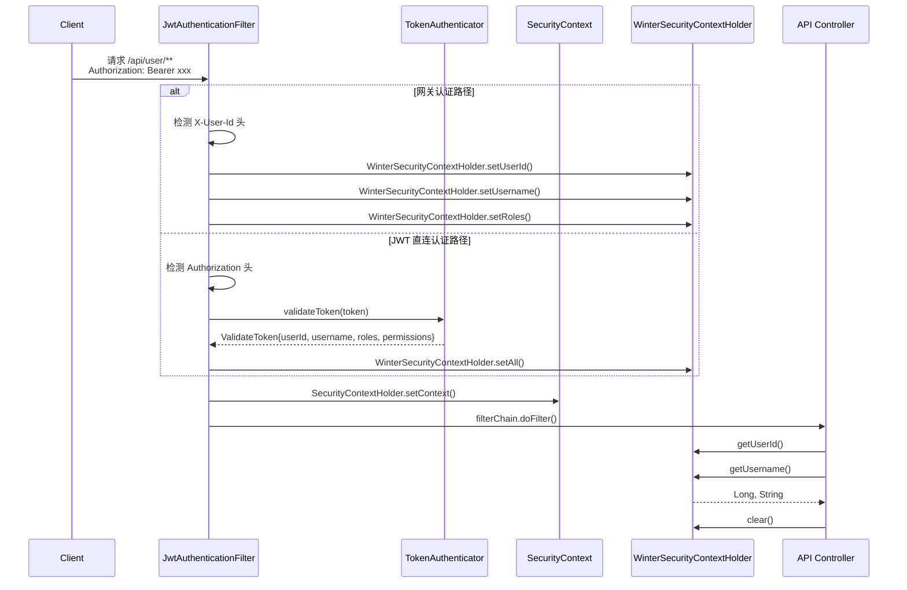
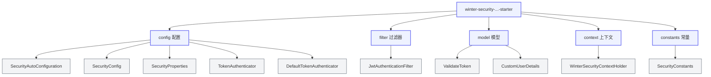

# Winter Security Spring Boot 3 Starter

[English](./README.md) | [中文](./README_zh.md)

---

Spring Security 认证授权（JWT）快速集成工具，专为 Spring Boot 3 应用设计。

## 项目目的

本项目旨在为 Spring Boot 3 应用提供一套**开箱即用**的认证授权解决方案。开发者无需深入了解 Spring Security 的复杂配置，只需几行配置即可实现：

- API 接口认证
- 用户上下文管理
- 权限控制

## 解决了什么问题

### 1. 简化 Spring Security 集成

Spring Security 配置复杂，学习成本高。本项目封装了认证过滤链，开发者只需实现 `TokenAuthenticator` 接口即可完成认证逻辑。

### 2. 支持双路径认证模式

| 认证模式 | 适用场景 | 说明 |
|---------|----------|------|
| **网关认证** | 微服务架构 | 网关统一认证，通过 HTTP 头传递用户信息 |
| **JWT 直连认证** | 直连服务 | 服务直接解析 JWT Token |

### 3. 解决线程池上下文丢失问题

使用 `TransmittableThreadLocal` (TTL) 技术，确保在异步调用、线程池复用等场景下用户上下文不会丢失。

### 4. 提供便捷的用户上下文获取

```java
// 在任意位置获取当前登录用户信息
Long userId = WinterSecurityContextHolder.getUserId();
String username = WinterSecurityContextHolder.getUsername();
List<String> roles = WinterSecurityContextHolder.getRoles();
List<String> permissions = WinterSecurityContextHolder.getPermissions();
```

## 技术栈

| 技术 | 版本 | 说明 |
|------|------|------|
| Java | 17+ | 必须使用 Java 17 及以上版本 |
| Spring Boot | 3.5.0 | 核心框架 |
| Spring Security | 3.5.0 | 安全框架 |
| TTL | 2.14.5 | 解决线程池上下文传递问题 |
| Lombok | - | 简化代码 |

## 项目架构

### 整体架构图

```mermaid
flowchart TB
    subgraph Client["客户端"]
        HTTP[HTTP Request]
    end

    subgraph Gateway["网关层"]
        GW[Gateway]
    end

    subgraph Security["Winter Security"]
        subgraph Filter["JwtAuthenticationFilter"]
            Check1{检查 X-User-Id<br/>网关头}
            Check2{检查 Authorization<br/>Bearer Token}
            GW_AUTH[网关认证]
            JWT_AUTH[JWT 认证]
        end

        subgraph Config["配置层"]
            SC[SecurityConfig]
            SP[SecurityProperties]
            SAC[SecurityAutoConfiguration]
        end

        subgraph Context["上下文层"]
            WSC[WinterSecurityContextHolder]
            TTL[TransmittableThreadLocal]
        end
    end

    subgraph Target["目标服务"]
        API[业务 API]
        SEC[@PreAuthorize]
    end

    HTTP --> GW
    GW -->|"X-User-Id<br/>X-Username<br/>X-User-Roles<br/>X-User-Permissions"| Check1
    HTTP -->|"Authorization: Bearer xxx"| Check2

    Check1 -->|"有网关头"| GW_AUTH
    Check2 -->|"有Token"| JWT_AUTH

    GW_AUTH --> WSC
    JWT_AUTH --> WSC

    JWT_AUTH -->|"验证Token"| TA[TokenAuthenticator<br/>接口]

    WSC <--> TTL
    WSC --> SC

    SC --> SEC
    SC --> API

    SAC --> SP
    SAC --> SC

    classDef primary fill:#4F46E5,stroke:#3730A3,color:#fff
    classDef secondary fill:#10B981,stroke:#047857,color:#fff
    classDef accent fill:#F59E0B,stroke:#B45309,color:#fff
    classDef config fill:#6366F1,stroke:#4F46E5,color:#fff

    class HTTP,GW primary
    class GW_AUTH,JWT_AUTH secondary
    class WSC,TTL,TA accent
    class SC,SP,SAC config
```

### 请求认证流程



### 模块结构



## 扩展点

项目提供以下可扩展接口和配置点：

### TokenAuthenticator 认证器接口

核心扩展接口，支持任意 Token 类型（JWT、OAuth2、自定义 Token）。

```java
@FunctionalInterface
public interface TokenAuthenticator {
    AuthResult authenticate(String token);
}
```

| 内置实现 | 说明 |
|---------|------|
| `DefaultTokenAuthenticator` | 开发环境默认实现，生产环境必须替换 |

通过 `@ConditionalOnMissingBean` 注册自定义实现自动覆盖默认：

```java
@Component
public class JwtTokenAuthenticator implements TokenAuthenticator {
    @Override
    public AuthResult authenticate(String token) {
        // 解析 JWT、验证签名、查询用户权限...
        return AuthResult.success(validateToken);
    }
}
```

### WinterSecurityContextHolder 用户上下文

基于 TTL 的上下文持有者，提供跨线程的用户信息访问：

| 方法 | 返回类型 | 说明 |
|------|---------|------|
| `getUserId()` | `String` | 获取用户 ID |
| `getUserIdAsLong()` | `Long` | 获取用户 ID（Long 类型） |
| `getUsername()` | `String` | 获取用户名 |
| `getRoles()` | `List<String>` | 获取角色列表 |
| `getPermissions()` | `List<String>` | 获取权限列表 |
| `hasRole(String)` | `boolean` | 检查是否具有某角色 |
| `hasPermission(String)` | `boolean` | 检查是否具有某权限 |

### Spring Security 注解支持

配置类已启用 `@EnableMethodSecurity`，支持三种权限注解：

| 注解 | 启用方式 | 示例 |
|------|---------|------|
| `@PreAuthorize` / `@PostAuthorize` | 默认启用 | `@PreAuthorize("hasRole('ADMIN')")` |
| `@Secured` | `securedEnabled = true` | `@Secured("ROLE_USER")` |
| `@RolesAllowed` | `jsr250Enabled = true` | `@RolesAllowed("USER")` |

### 异常处理委托

认证和授权异常自动委托给 Spring 的 `HandlerExceptionResolver`，与 `@RestControllerAdvice` 全局异常处理器无缝集成：

```java
@RestControllerAdvice
public class GlobalExceptionHandler {
    @ExceptionHandler(AuthenticationException.class)
    public Result<Void> handleAuthException(AuthenticationException e) {
        return Result.error(401, "未授权");
    }
}
```

## 快速开始

### 1. 添加依赖

```xml
<dependency>
    <groupId>io.github.hahaha-zsq</groupId>
    <artifactId>winter-security-spring-boot3--starter</artifactId>
    <version>0.0.1</version>
</dependency>
```

### 2. 配置文件

```yaml
winter:
  security:
    whitelist:
      urls:
        - /api/public/**
        - /actuator/health
    authorization-header: Authorization
    bearer-prefix: "Bearer "
    user-id-header: X-User-Id
    username-header: X-Username
    roles-header: X-User-Roles
    permissions-header: X-User-Permissions
```

### 3. 自定义 Token 验证器

```java
@Component
@RequiredArgsConstructor
public class MyTokenAuthenticator implements TokenAuthenticator {

    private final JwtService jwtService;

    @Override
    public ValidateToken validateToken(String token) {
        // 实现你的 Token 验证逻辑
        Claims claims = jwtService.parseToken(token);

        return ValidateToken.builder()
            .userId(claims.get("userId", Long.class))
            .username(claims.getSubject())
            .roles(parseRoles(claims))
            .permissions(parsePermissions(claims))
            .build();
    }
}
```

### 4. 使用用户上下文

```java
@RestController
@RequestMapping("/api/user")
@RequiredArgsConstructor
public class UserController {

    @GetMapping("/profile")
    public Result<UserVO> getProfile() {
        Long userId = WinterSecurityContextHolder.getUserId();
        String username = WinterSecurityContextHolder.getUsername();
        // 业务逻辑
    }
}
```

### 5. 权限控制

```java
@GetMapping("/admin")
@PreAuthorize("hasRole('ADMIN')")
public Result<Void> adminOnly() {
    return Result.success();
}
```

## 配置项说明

| 配置项 | 类型 | 默认值 | 说明 |
|--------|------|--------|------|
| `winter.security.whitelist.urls` | List\<String\> | `[]` | 白名单路径，支持 Ant 风格 |
| `winter.security.user-id-header` | String | `X-User-Id` | 用户ID请求头名称 |
| `winter.security.username-header` | String | `X-Username` | 用户名请求头名称 |
| `winter.security.roles-header` | String | `X-User-Roles` | 角色请求头名称 |
| `winter.security.permissions-header` | String | `X-User-Permissions` | 权限请求头名称 |
| `winter.security.authorization-header` | String | `Authorization` | JWT认证头名称 |
| `winter.security.bearer-prefix` | String | `Bearer ` | Bearer前缀 |

## License

Apache-2.0 License